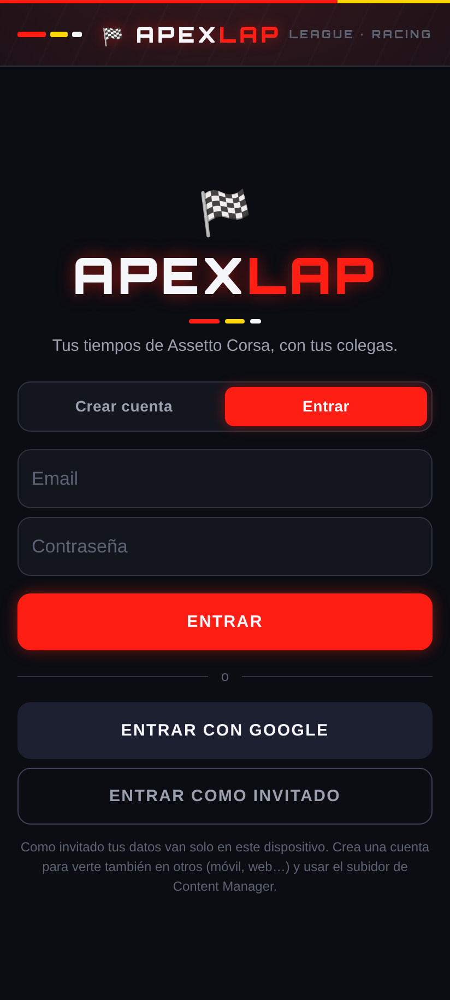
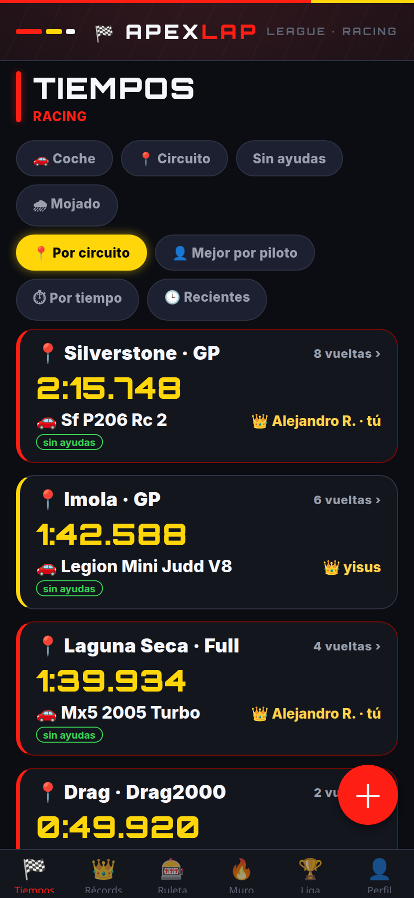
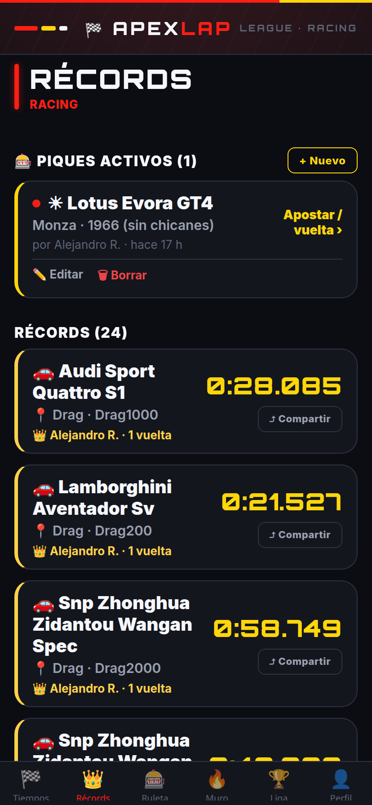
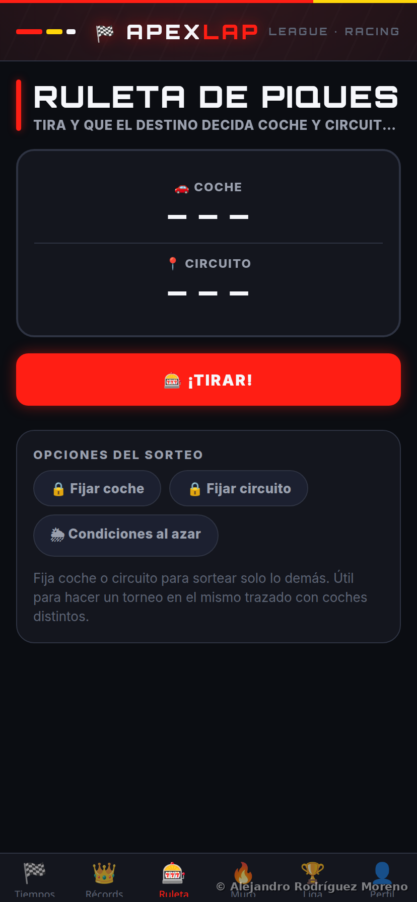
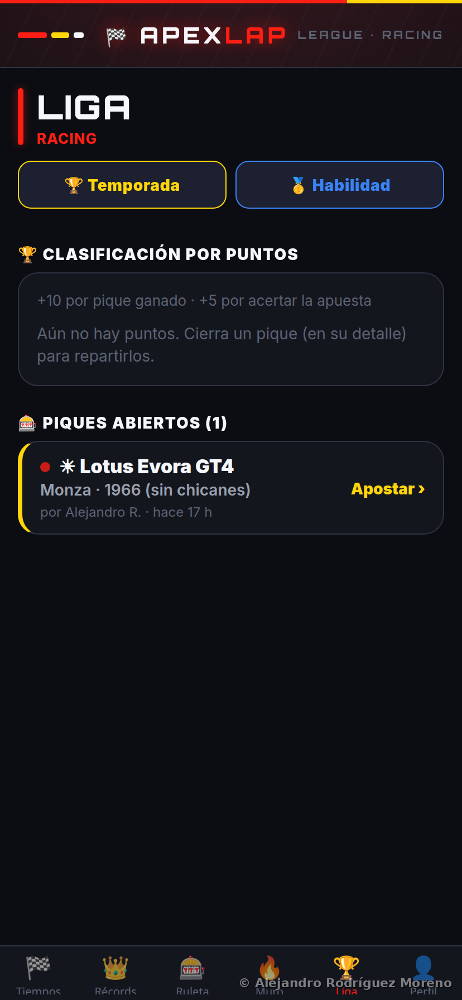
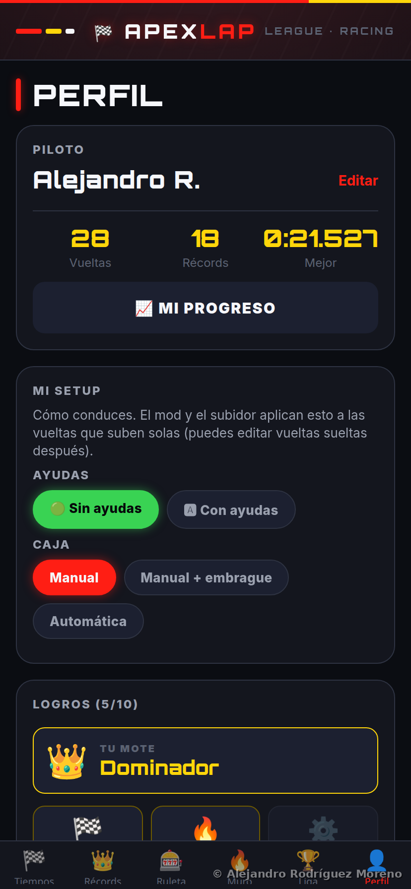

# 🏁 ApexLap

App móvil (Android) y **web** para guardar **tiempos de vuelta** de
*Assetto Corsa* con tus colegas, comparar quién es más rápido, **picaros** con
una ruleta que sortea coche y circuito, y hasta **apostar** por el ganador.

Hecha con **Expo (React Native + TypeScript)** y **Firebase** (nube compartida
en tiempo real). Un código de liga junta a todo el grupo: lo que registra uno,
lo ven todos al instante.

<p align="center">
  
</p>

---

## ✨ Funciones

### Vueltas y rankings
- **Registro de vueltas**: coche, circuito (con trazado), tiempo `m:ss.mmm`,
  **sectores** (S1/S2/S3) opcionales, condiciones (seco/mojado/mixto), ayudas
  sí/no, caja de cambios y notas.
- **Ranking en vivo**: lista ordenada por tiempo con podio 🥇🥈🥉 y *delta* al
  líder. Filtros por coche, circuito, "sin ayudas" y "mojado". Modo
  **mejor de cada piloto** o **vueltas recientes**.
- **Récords** 👑: quién tiene la vuelta más rápida en cada combinación
  coche + circuito, con **detalle por pista** y **tarjeta compartible** del récord.
- **Vuelta teórica** 🧪: en el detalle de un coche, el tiempo ideal alcanzable
  combinando el mejor S1/S2/S3 registrado, con el dueño de cada sector.
- **Histórico y progreso** 📈: gráfica de tu evolución de tiempos por coche +
  circuito a lo largo del tiempo, con tu mejor marca y la mejora total (Perfil).

### Importación automática desde el juego 🎮
No hace falta meter los tiempos a mano. Hay tres acompañantes en [`tools/`](tools/):
- **Mod in-game (Lua/CSP)** — [`tools/ApexLap`](tools/ApexLap/): app dentro de
  Assetto Corsa que detecta tus vueltas limpias y las **sube solas** mientras
  juegas. Requiere Custom Shaders Patch.
- **Subidor de escritorio (Python)** — [`tools/cm-uploader`](tools/cm-uploader/):
  vigila la carpeta de resultados de Content Manager y sube las vueltas. Windows,
  Mac y Linux, solo Python 3.
- **Importador web** — [`tools/web-import`](tools/web-import/): pega/sube los
  ficheros de resultados desde el navegador.

Las vueltas importadas entran como **verificadas**; las manuales entran como
**pendientes** y el anfitrión las aprueba o rechaza (con **foto de prueba**
opcional) para evitar trampas.

### Piques, apuestas y liga
- **Ruleta de piques** 🎰: tragaperras que sortea coche y circuito (y
  opcionalmente condiciones). Puedes **fijar** el coche o el circuito para
  sortear solo lo demás. Convoca un pique que les aparece a todos.
- **Retos / piques** con ciclo de vida: abierto → cerrado, con **ganador**
  fijado a la mejor vuelta válida del pique.
- **Apuestas** 🎲: cada piloto predice quién ganará un pique (incluido él mismo).
- **Clasificación por puntos** 🏆: suma por **pique ganado** y por **acertar la
  apuesta**; tabla de la liga con podio.
- **Modo temporada** 🏆: cada pique cerrado es un evento que reparte puntos
  **F1-style** (25-18-15…) por posición; clasificación de temporada acumulada y
  lista de eventos (desde Liga).
- **Ranking de habilidad (ELO)** 🥇: puntuación que sube/baja según a quién bates
  en los piques (no solo acumular), con su propio ranking compartible.
- **Comentarios en los piques** 💬: hilo de pulla en tiempo real en cada pique.
- **Compartir resultado** 📲: tarjeta del pique ganado lista para mandar al grupo.
- **Comparador 1 vs 1** 🆚: enfrenta dos vueltas (mismo coche+circuito) con el
  desglose por sector y el delta acumulado — para ver dónde se gana el pique.
- **Muro** 🔥: feed de rivalidad en vivo (vueltas, récords batidos, "X manda en
  tu combo", piques nuevos y ganados).
- **Logros y motes** 🏅: insignias que desbloqueas (Rodador, Plusmarquista,
  Trotamundos…) y motes comparativos de la liga (Dominador, Rey del mojado…),
  en el Perfil y junto a cada nombre en la clasificación.
- **Juice** ✨: sonido, vibración (haptics) y **confeti** al tirar la ruleta y al
  ganar un pique.

### Cuenta, liga y avisos
- **Ligas**: crea una y comparte el código; o únete con el de un colega. Lista de
  **participantes**.
- **Cuenta**: email + contraseña, **Google** (web y app Android) o **invitado**
  (anónimo).
- **Catálogo de la liga**: coches/circuitos personalizados (mods, DLC) que añaden
  los miembros, con etiqueta de origen (MOD/KUNOS/AC) y URL de descarga.
- **Notificaciones push** 🔔 (Expo, sin servidor propio): aviso a los demás de la
  liga cuando registras una vuelta o convocas un pique. Solo en app nativa.
- **Perfil y estadísticas**: tus vueltas, récords y mejor tiempo, más la
  clasificación de pilotos de la liga.
- **Tarjeta de piloto** 🪪: comparte tu tarjeta (mote, vueltas, récords, piques,
  logros y mejor vuelta) como imagen.
- **Objetivos personales** 🎯: fíjate un tiempo a batir en un coche+circuito y
  sigue cuánto te falta (en "Mi progreso").
- **Compartir clasificación** 📊: la tabla de la liga / temporada / habilidad,
  como imagen para mandar al grupo.

---

## 📸 Capturas

| Login | Tiempos | Récords |
|---|---|---|
|  |  |  |

| Ruleta | Liga (puntos) | Perfil |
|---|---|---|
|  |  |  |

---

## 🚀 Puesta en marcha

1. Instala dependencias (ya hecho si tienes `node_modules`):
   ```bash
   npm install
   ```
2. **Configura Firebase** (ver abajo) — sin esto la app muestra una pantalla con
   los pasos y no guarda datos.
3. Arranca en local para desarrollar:
   ```bash
   npm run web      # abre en el navegador (lo más rápido para iterar)
   # o   npm start  # y escanea el QR con Expo Go si quieres probar en el móvil
   ```

Para que **tú y tus colegas la uséis de verdad sin instalar nada raro**, hay dos
vías (no necesitáis "Expo Go"):

### 🌐 Web — un enlace, funciona en iPhone y Android

La app corre en el navegador. La despliegas una vez y todos abren la misma URL
(pueden hacer *"Añadir a pantalla de inicio"* y les queda como una app).

Desplegar gratis en **Firebase Hosting** (mismo proyecto que ya usas):
```bash
npm install -g firebase-tools
firebase login
firebase use --add            # elige tu proyecto Firebase (solo la 1ª vez)
npm run deploy:web            # exporta /dist, empaqueta el mod y sube hosting + reglas
```
Te dará una URL tipo `https://TU-PROYECTO.web.app`. ¡Esa es la que pasas al grupo!

> Alternativa: cualquier hosting estático sirve (Vercel, Netlify…). Genera la web
> con `npm run build:web` y sube la carpeta `dist/`. Si **no** usas Firebase
> Hosting, añade tu dominio en *Firebase Console › Authentication › Settings ›
> Authorized domains*, o el login fallará. (Los dominios `*.web.app` y
> `*.firebaseapp.com` ya vienen autorizados.)

### 📦 APK de Android — app instalable

Genera un `.apk` que se instala como cualquier app (sin Expo Go), con build en la
nube gratis de Expo (**EAS**):
```bash
npm install -g eas-cli
eas login                     # crea una cuenta Expo gratis si no tienes
npm run build:apk             # build en la nube; al acabar te da un enlace de descarga
```
Pasa ese enlace/`.apk` a tus colegas de Android. (En el móvil hay que permitir
"instalar apps de orígenes desconocidos".)

> **iOS instalable** (no web) requiere cuenta Apple Developer (99 €/año) y
> `eas build -p ios`. Para iPhone, la vía gratis es la **web** de arriba.

---

## 🔧 Configurar Firebase (gratis, ~5 min)

1. Entra en <https://console.firebase.google.com> → **Add project**.
2. **Build › Firestore Database** → *Create database* (empieza en *modo test*).
3. **Build › Authentication › Sign-in method** → habilita **Anonymous**
   (invitado) y **Email/Password**. (Para "Entrar con Google" habilita también
   **Google** y pega el Web client ID en `src/auth/googleConfig.ts`.)
4. **⚙ Project settings › Tus apps** → añade una app **Web** (`</>`) y copia el
   objeto `firebaseConfig`.
5. Pega esos valores en [`src/firebase/config.ts`](src/firebase/config.ts)
   (sustituye los `PEGA_AQUI_...`).
6. **Reglas de seguridad**: en *Firestore Database › Rules*, pega el contenido
   de [`firestore.rules`](firestore.rules) y pulsa **Publicar** (o se suben solas
   con `npm run deploy:web`). Para las **fotos de prueba**, habilita *Storage*.

En cuanto guardes la config, la pantalla de "Conecta Firebase" desaparece sola.

---

## 🗂️ Estructura

```
src/
  data/            catálogo de coches y circuitos de Assetto Corsa (base)
  firebase/        config.ts (tus claves) + db.ts (servicio Firestore)
  auth/            login con Google (nativo + stub web) y config
  context/         AppContext: sesión, perfil, liga y vueltas en vivo
  components/      UI reutilizable (botones, cards, selector, marco web)
  screens/         Tiempos, Récords, Ruleta, Liga, Perfil, Reto, Pista,
                   Participantes, Onboarding, Auth, Setup
  navigation/      tabs inferiores + stack (añadir vuelta, reto, pista…)
  utils/           parseo/formato de tiempos y cálculos de ranking
  notifications.ts push con la API de Expo (sin servidor propio)
firestore.rules    reglas de seguridad para pegar en la consola
tools/             importadores: mod Lua (CSP), subidor Python (CM), web-import
docs/screenshots/  capturas para el README
```

Modelo de datos (Firestore): `leagues/{id}` con subcolecciones `laps`,
`challenges` (con `bets`), `cars` y `tracks`; y `profiles/{uid}`.

Los **coches y circuitos** base salen de `src/data/` (Assetto Corsa vanilla, sin
DLC de pago). El selector permite **escribir cualquiera a mano** y se guardan en
el catálogo compartido de la liga, así que podéis añadir vuestros mods y DLC.

---

## 💡 Ideas para seguir creciendo

Cosas que harían la app aún más adictiva (no implementadas todavía):

- **Calendario de temporada**: agrupar eventos por fechas/jornadas con apertura
  y cierre automáticos (hoy la temporada agrega todos los piques cerrados).
- **Multi-liga**: pertenecer a varias ligas y cambiar entre ellas.
- **ABS/TC en la app**: el mod ya sube el estado real de **ABS y TC** por vuelta
  (campos `abs`/`tc`); falta mostrarlos/filtrar por ellos en las pantallas.

> El mod (`tools/ApexLap`, [release v1.1](../../releases/tag/v1.1)) **ya probado en
> el juego**: detecta y sube tus vueltas limpias, ayudas/caja del perfil declarado,
> ABS/TC descriptivos del juego, clima seco/mixto/mojado, **battle the ghost**
> (récord de la liga en pantalla con tu delta) y **aviso push de récord arrebatado**.

¿Quieres alguna de estas? Dímelo y la añadimos. 🏎️

---

<p align="center">
  Hecho con 🏁 por <strong>Alejandro Rodríguez Moreno</strong>
  · <a href="https://github.com/alejandrorodm">@alejandrorodm</a>
</p>
